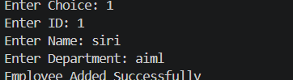
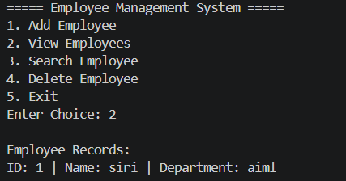

# Employee Management System using Java

## 📌 Project Overview

Employee Management System is a console-based Java application developed using Core Java concepts.

This project helps manage employee records through a menu-driven program. The application allows users to add, view, search, and delete employee details.

Employee data is permanently stored using Java File Handling.

---

# 🚀 Features

✅ Add Employee  
✅ View Employees  
✅ Search Employee by ID  
✅ Delete Employee  
✅ File Handling for Data Storage  
✅ Menu Driven Application  
✅ Exception Handling  
✅ OOP Concepts Implementation  

---

# 🛠 Technologies Used

- Core Java
- VS Code
- File Handling
- Collections Framework
- OOP Concepts

---

# 📂 Project Structure

```text
EmployeeManagementSystem
│
├── Main.java
├── Employee.java
├── EmployeeManager.java
├── employees.txt
├── README.md
└── screenshots
      ├── menu.png
      ├── add.png
      ├── view.png
      └── search.png
```

---

# 📸 Project Screenshots


## Add Employee



---

## View Employees



---


# ⚙️ How to Run the Project

## Step 1
Open the project in VS Code.

## Step 2
Run the following commands in terminal:

```bash
javac *.java
```

```bash
java Main
```

---

# 📋 Sample Output

```text
===== Employee Management System =====

1. Add Employee
2. View Employees
3. Search Employee
4. Delete Employee
5. Exit

Enter Choice:
```

---

# 💾 File Handling

Employee records are stored inside:

```text
employees.txt
```

Example:

```text
1,Siri,1
2,Rahul,2
```

---

# 🎯 Concepts Used

- Classes and Objects
- Constructors
- ArrayList
- FileWriter
- BufferedReader
- Exception Handling
- Loops and Conditions
- Menu Driven Programming

---

# 👩‍💻 Author

Siri Reddy Gudipally

---

# 📈 Future Enhancements

- Add Update Employee Feature
- Add Login Authentication
- Add Attendance Management
- Integrate MySQL Database
- Create GUI using Java S